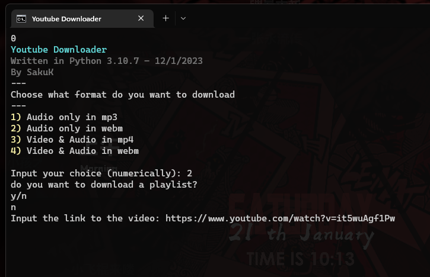

# **Youtube Downloader with Python**

by SakuK - 01/2023

This is a tool that I use for downloading Youtube videos on my computer.
I wrote it using the [yt-dlp](https://github.com/yt-dlp/yt-dlp) library.

The reason for writing this was to learn a bit about using libraries
for Python. But mostly I wrote it so I wouldn't need to bare those
awful youtube video downloader websites (this is way faster as well)

To use this downloader, just clone this repository, add the needed
yt-dlp package to your pip and double click the batch file.

*the images folder includes an icon ready to be assigned to the
batch file, if you would like to make it easier to spot.*

## Dependencies 

* [yt-dlp](https://github.com/yt-dlp/yt-dlp) - Youtube-dl fork
* [ffmpeg](https://www.ffmpeg.org/) - For converting the video to mp4

```python
 pip install yt-dlp
```

## Preview


